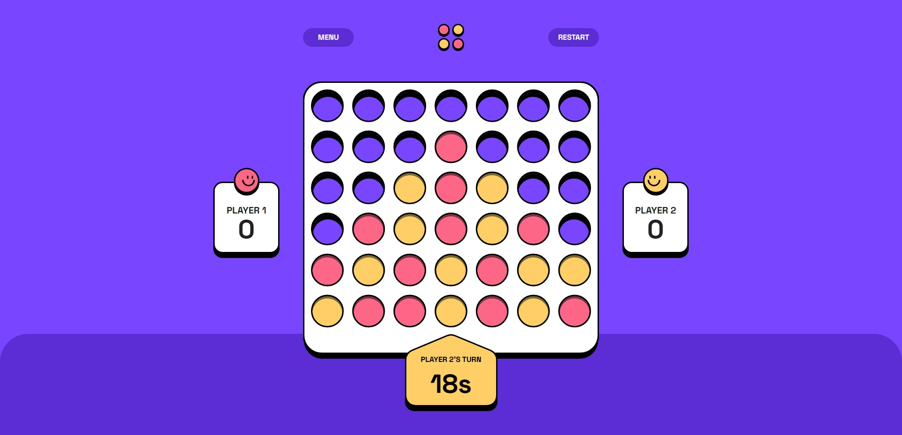

# Frontend Mentor - Connect Four game solution

This is a solution to the [Connect Four game challenge on Frontend Mentor](https://www.frontendmentor.io/challenges/connect-four-game-6G8QVH923s). Frontend Mentor challenges help you improve your coding skills by building realistic projects.

## Table of contents

- [Overview](#overview)
  - [The challenge](#the-challenge)
  - [Screenshot](#screenshot)
  - [Links](#links)
- [My process](#my-process)
  - [Built with](#built-with)
  - [What I learned](#what-i-learned)
  - [Continued development](#continued-development)
  - [Useful resources](#useful-resources)
- [Author](#author)

## Overview

### The challenge

Users should be able to:

- View the game rules
- Play a game of Connect Four against another human player (alternating turns on the same computer)
- View the optimal layout for the interface depending on their device's screen size
- See hover and focus states for all interactive elements on the page
- **Bonus**: See the discs animate into their position when a move is made
- **Bonus**: Play against the computer

### Screenshot

### Links

- Solution URL: [Solution](https://www.frontendmentor.io/solutions/connect-four-game-UECdb5C6Pe)
- Live Site URL: [Connect Four](https://webguy83.github.io/connect-four-react/)

## My process

### Built with

- [React](https://reactjs.org/) - JS library
- [MUI](https://mui.com/) - React UI framework
- [TypeScript](https://www.typescriptlang.org/) - TypeScript
- Flexbox
- Mobile-first workflow

### What I learned

Where do I begin? Learned a ton about using custom hooks in React and utilizing several useful components in MUI in regards to the Sliding animations and custom buttons, etc. Also learned a ton of logical problem solving which was the biggest aspect of completing this challenge especially when making the CPU ai and having it be somewhat intelligent.

### Continued development

Definitely will look at building new games that have similiar complex logic. This was fun to build!

### Useful resources

- [Approach to building Connect Four](https://parzibyte.me/blog/en/2020/08/24/connect-4-javascript-html/) - This helped to sort of get an idea of one such approach however I didn't use any of the code and this was done in VueJS while I used React.
- [Approach for making CPU](https://parzibyte.me/blog/2020/07/11/algoritmo-simple-ganar-conecta-4/) - Be sure to translate this page to English via the Google Translate. After the translate this helped me get an idea to an approach for the CPU AI. I went the extra mile and fixed the failures this approach had by checking the for the next move.

## Author

- Github - [Curtis](https://github.com/webguy83)
- Frontend Mentor - [@webguy83](https://www.frontendmentor.io/profile/webguy83)
